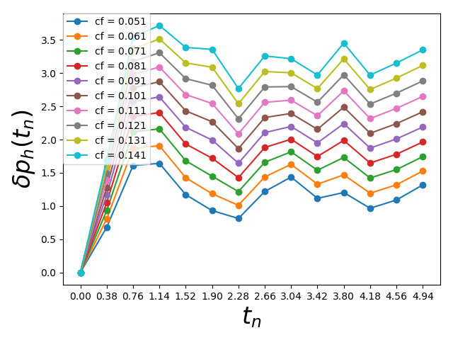
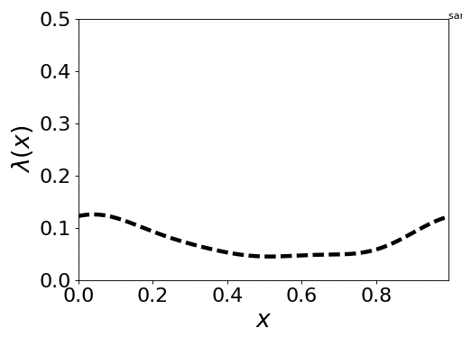

# Uncertainty Quantification software for gas pipes 

This is a software package written in C++ and Python for solving
Bayesian inverse problems that occur in the Gas industry, e.g., to
identify friction coefficients in gas pipes.

## Downloading the package
**requirement**: `make`, `g++`, `python2.7`

download the package either through git,
```sh
git clone https://github.com/hajianOne/UQ.git
```
or download it directly from
[GitHub](https://github.com/hajianOne/UQ.git)
and decompress it. Go into the package directory. 
You should see the following folder structure
```
UQ
|-- makefile
|-- README.md
|-- requirements.txt
|-- setup.py
|-- build
|-- build_cpp
|-- examples
|-- lib
|-- results
|-- src
`-- UQuant
```

## Quick Installation on Mac OS

In order to compile and install the package execute the following commands:
```sh
make lib/CWrapper.dylib   
pip install -r requirements.txt
python setup.py install
```
The first command generates a shared library and save a file called
`CWrapper.dylib` in `lib/` directory and `CWrapper.so` in
`UQuant/lib/` directory. The second command installs python package in
`UQuant` folder and the shared library.

If you didn't receive any error, you should be able to import the
libraries in the python. For instance the following code should
produce an output describing the pipe:
```python
from UQuant.SemilinearSystem import SemiLinSystem
from UQuant.mcmc             import MCMC

c_sound, t_final, x_l, x_r, dx, boundary_eps = [1.0, 5.0, 0.0, 1.0, 0.005, 0.05]
expan_coef = 1
true_friction = [0.075]

# build the pipe
pipe_true = SemiLinSystem(c_sound, t_final, x_l, x_r, dx, expan_coef, boundary_eps)
# get the info of the pipe
pipe_true.info()
# compute the solution of the semilinear system with the prescribed friction coefficients
pipe_true.run(true_friction) 
# get the pressure drop
y_obs = pipe_true.get_presure_drop(time_instance=time_ins, inplace=False)
```

## Quick Installation on Linux

In order to compile and install the package execute the following commands:
```sh
make lib/CWrapper.so
pip install -r requirements.txt
python setup.py install
```
The first command generates a shared library and save a file called
`CWrapper.so` in `lib/` directory and `CWrapper.so` in
`UQuant/lib/` directory. The second command installs python package in
`UQuant` folder and the shared library.

If you didn't receive any error, you should be able to import the
libraries in the python. For instance the following code should
produce an output describing the pipe:
```python
from UQuant.SemilinearSystem import SemiLinSystem
from UQuant.mcmc             import MCMC

c_sound, t_final, x_l, x_r, dx, boundary_eps = [1.0, 5.0, 0.0, 1.0, 0.005, 0.05]
expan_coef = 1
true_friction = [0.075]

# build the pipe
pipe_true = SemiLinSystem(c_sound, t_final, x_l, x_r, dx, expan_coef, boundary_eps)
# get the info of the pipe
pipe_true.info()
# compute the solution of the semilinear system with the prescribed friction coefficients
pipe_true.run(true_friction) 
# get the pressure drop
y_obs = pipe_true.get_presure_drop(time_instance=time_ins, inplace=False)
```


## Testing

If everything goes well you should be able to test the package. First
go to the root directory of the package, e.g., `UQ` and then execute
the following command

```bash
python examples/test.py
```	
The output in the console looks like
```
Address of the pipe in the memory from cpp: 0x1328660
Address of the pipe in the memory from python:  0x1328660
========================================== info ==
Omega _____________________________(0,1)
Length of the domain ______________1
Dt ________________________________0.005
Dx ________________________________0.005
Number of cells ___________________200
Current time ______________________0
Final time ________________________5
Epsilon for the boundary __________0.05
N_epsilon _________________________10
Size of friction coef. vec. _______7
==================================================
>> Computation Done
```

and also you should be able to see the following figure which shows
continuous dependence of the pressure drop at both ends of the pipe
with respect to the friction coefficient.



In the second test we will run the Markov-Chain Monte-Carlo (MCMC)
algorithm for the case where the friction coefficient is a scalar number:
```sh
python examples/test0.py
```
The output is saved in `results/friction_scalar.png`:


In this example, the true friction coefficient is `0.075` and we
provide a prior density function with uniform distribution in the
interval `[0.0, 0.5]`. The initial sample is located at `0.45` (far
from the true value). Observe that the posterior distribution captures
the truth and samples are clustered around `0.075`.

We can also perform an experiment when the friction coefficient is a
function. The script is called `uq.py` and is located in `examples`
folder. In order to test, execute
```sh
python examples/uq.py
```
In the following figure we can see the true friction coefficient as a
function of spatial coordinates and the sequence of samples obtained from
MCMC.



<!-- ```python -->
<!-- from UQuant.SemilinearSystem import SemiLinSystem -->
<!-- from UQuant.mcmc             import MCMC -->

<!-- c_sound, t_final, x_l, x_r, dx, boundary_eps = [1.0, 5.0, 0.0, 1.0, 0.005, 0.05] -->
<!-- expan_coef = 1 -->
<!-- true_friction = [0.075] -->

<!-- # true friction coefficient -->
<!-- pipe_true = SemiLinSystem(c_sound, t_final, x_l, x_r, dx, expan_coef, boundary_eps) -->
<!-- pipe_true.run(true_friction) -->
<!-- y_obs = pipe_true.get_presure_drop(time_instance=time_ins, inplace=False) -->

<!-- # construct a pipe for computation -->
<!-- pipe = SemiLinSystem(c_sound, t_final, x_l, x_r, dx, expan_coef, boundary_eps) -->

<!-- ``` -->
