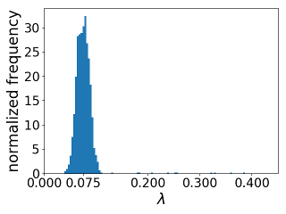

[](https://travis-ci.org/hajianOne/UQ)

* [Introduction](#introduction)
* [Download and installation](#download-and-installation)
  - [Quick Installation on Mac OS](#quick-installation-on-mac-os)
  - [Quick Installation on Linux](#quick-installation-on-linux)
  - [Testing](#testing)
  - [preconditioned Crank Nicolson](#pcn)
* [Disclaimer](#disclaimer)
* [References](#references)

# Introduction

This is a software package written in C++ and Python for solving
Bayesian inverse problems that occur in the gas industry, e.g., to
identify friction coefficients in gas pipes. The flow of the gas in a
pipe is modelled using a quasi-linear iso-thermal model, and the gas
is subject to friction. The behavior of the gas is described by its
pressure and momentum along the pipe.

The task is to obtain statistical properties of the friction
coefficient based on finite noisy observation of the pressure drop at
both ends of the gas pipe, and a prior knowledge on the friction
coefficient. As an example, we assume that the friction coefficient is
uniformly distributed in the interval `[0.0,0.5]` while the true value
is `0.075`, then the UQ package using Markov-Chain Monte Carlo (MCMC)
method and a discretization of the gas model, obtain a posterior
distribution for the friction coefficient. In the following Figure we
observe that the posterior distribution is clustered around the true
friction coefficient, i.e., `0.075`.



For more information see [References](#references).

# Download and installation 
## Downloading the package

**requirements**: `make`, `g++`, `python2.7` and `pip`

Download the package either through git,
```sh
git clone https://github.com/hajianOne/UQ.git
```
or download it directly from
[GitHub](https://github.com/hajianOne/UQ.git)
and decompress it. Go into the package directory. 
You should see the following folder structure:
```
UQ
|-- makefile
|-- README.md
|-- LICENSE.md
|-- requirements.txt
|-- setup.py
|-- build
|-- build_cpp
|-- examples
|-- notebooks
|-- lib
|-- results
|-- src
\-- UQuant
```

## Quick Installation on Mac OS

In order to compile and install the package execute the following
commands (make sure you have the right permissions):
```sh
make lib/CWrapper.dylib   
pip install -r requirements.txt
python setup.py install
```
The first command generates a shared library and save a file called
`CWrapper.dylib` in `lib/` directory and `CWrapper.so` in
`UQuant/lib/` directory. The second and third commands installs
python packages in `UQuant` folder and the shared library.

If you didn't receive any error, you should be able to import the
libraries in the python. For instance the following code should
produce an output describing the pipe:
```python
from UQuant.SemilinearSystem import SemiLinSystem
from UQuant.mcmc             import MCMC

c_sound, t_final, x_l, x_r, dx, boundary_eps = [1.0, 5.0, 0.0, 1.0, 0.005, 0.05]
expan_coef = 1
true_friction = [0.075]

# build the pipe
pipe_true = SemiLinSystem(c_sound, t_final, x_l, x_r, dx, expan_coef, boundary_eps)
# get the info of the pipe
pipe_true.info()
# compute the solution of the semilinear system with the prescribed friction coefficients
pipe_true.run(true_friction) 
# get the pressure drop
y_obs = pipe_true.get_presure_drop(time_instance=time_ins, inplace=False)
```

## Quick Installation on Linux

In order to compile and install the package execute the following
commands (make sure you have the right permissions):
```sh
make lib/CWrapper.so
pip install -r requirements.txt
python setup.py install
```
The first command generates a shared library and save a file called
`CWrapper.so` in `lib/` directory and `CWrapper.so` in
`UQuant/lib/` directory. The second and third commands installs python 
packages in `UQuant` folder and the shared library.

If you didn't receive any error, you should be able to import the
libraries in the python. For instance the following code should
produce an output describing the pipe:
```python
from UQuant.SemilinearSystem import SemiLinSystem
from UQuant.mcmc             import MCMC

c_sound, t_final, x_l, x_r, dx, boundary_eps = [1.0, 5.0, 0.0, 1.0, 0.005, 0.05]
expan_coef = 1
true_friction = [0.075]

# build the pipe
pipe_true = SemiLinSystem(c_sound, t_final, x_l, x_r, dx, expan_coef, boundary_eps)
# get the info of the pipe
pipe_true.info()
# compute the solution of the semilinear system with the prescribed friction coefficients
pipe_true.run(true_friction) 
# get the pressure drop
y_obs = pipe_true.get_presure_drop(time_instance=time_ins, inplace=False)
```


## Testing

If everything goes well you should be able to test the package. First
go to the root directory of the package, e.g., `UQ` and then execute
the following command

```bash
python examples/test.py
```	
The output in the console looks like
```
Address of the pipe in the memory from cpp: 0x1328660
Address of the pipe in the memory from python:  0x1328660
========================================== info ==
Omega _____________________________(0,1)
Length of the domain ______________1
Dt ________________________________0.005
Dx ________________________________0.005
Number of cells ___________________200
Current time ______________________0
Final time ________________________5
Epsilon for the boundary __________0.05
N_epsilon _________________________10
Size of friction coef. vec. _______7
==================================================
>> Computation Done
```

and also you should be able to see the following figure which shows
continuous dependence of the pressure drop at both ends of the pipe
with respect to the friction coefficient.


In the second test we will run the Markov-Chain Monte-Carlo (MCMC)
algorithm for the case where the friction coefficient is a scalar number:
```sh
python examples/test0.py
```
The output is saved in `results/friction_scalar.png`:


In this example, the true friction coefficient is `0.075` and we
provide a prior density function with uniform distribution in the
interval `[0.0, 0.5]`. The initial sample is located at `0.45` (far
from the true value). Observe that the posterior distribution captures
the truth and samples are clustered around `0.075`.

We can also perform an experiment when the friction coefficient is a
function. The script is called `uq.py` and is located in `examples`
folder. In order to test, execute
```sh
python examples/uq.py
```
In the following figure we can see the true friction coefficient as a
function of spatial coordinates and the sequence of samples obtained from
MCMC.


<!-- ```python -->
<!-- from UQuant.SemilinearSystem import SemiLinSystem -->
<!-- from UQuant.mcmc             import MCMC -->

<!-- c_sound, t_final, x_l, x_r, dx, boundary_eps = [1.0, 5.0, 0.0, 1.0, 0.005, 0.05] -->
<!-- expan_coef = 1 -->
<!-- true_friction = [0.075] -->

<!-- # true friction coefficient -->
<!-- pipe_true = SemiLinSystem(c_sound, t_final, x_l, x_r, dx, expan_coef, boundary_eps) -->
<!-- pipe_true.run(true_friction) -->
<!-- y_obs = pipe_true.get_presure_drop(time_instance=time_ins, inplace=False) -->

<!-- # construct a pipe for computation -->
<!-- pipe = SemiLinSystem(c_sound, t_final, x_l, x_r, dx, expan_coef, boundary_eps) -->

<!-- ``` -->

### Preconditioned Crank Nicolson (pCN)

In addition to MCMC, a dimension robust algorithm called pCN is also
implemented. For a test case please see `examples/pcn_uq.py` or the
jupyter notebook [`notebooks/pcn.ipynb`](notebooks/pcn.ipynb).

# Disclaimer

The UQ package is developed by S. Hajian, N. Strogies and
M. Hintermüller. The UQ package is supported financially by the German
Research Foundation DFG through the SFB-TRR 154 and funds from the
Einstein Center for Mathematics Berlin through C-SE5 and D-OT1. The
aforementioned package (including code modifications) may only be used
for NON-COMMERCIAL RESEARCH purposes. For inquiries concerning a
different use, please contact the authors. See the
[license](LICENSE.md).


# References
1. S. Hajian, M. Hintermüller, C. Schillings and N. Strogies, 
   **A Bayesian approach for parameter identification in gas networks**,
   in progress. 
   
